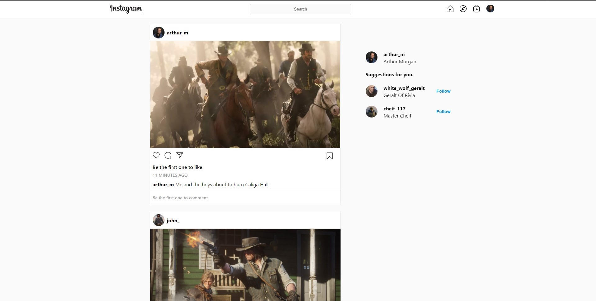
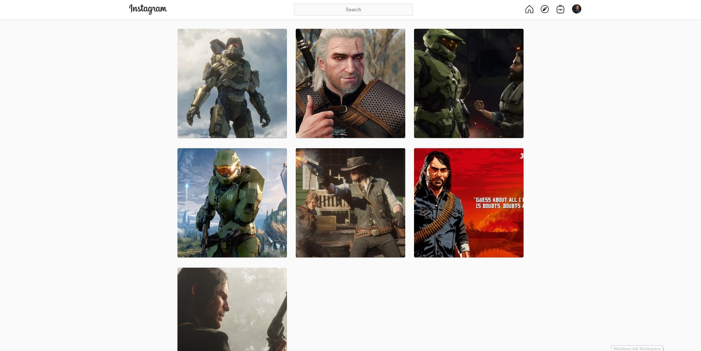
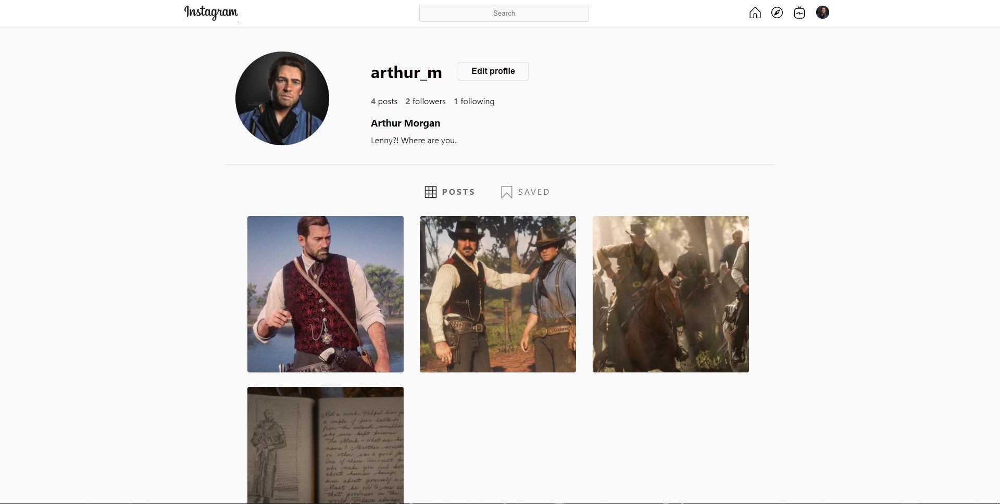
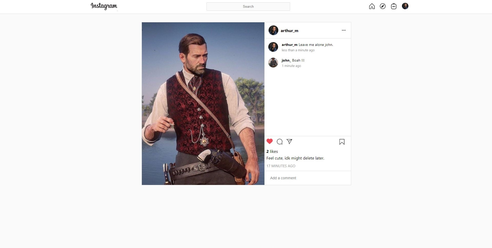

## Instagram Clone

> An Instagram clone made using React.js, Redux.js and Node.js

## Screenshots
 Homepage
 

 
 Explore



User Profile



Post




## Installation

Clone the repo:

```

git clone --depth https://github.com/vikS7/instagram-clone-frontend.git
cd instagram-clone-frontend

```
Install the dependencies:

```

npm install

```

## Commands 

Running locally :  ``npm start``


## Dependencies

- "react": "^17.0.1",
- "react-dom": "^17.0.1",
- "redux": "^4.0.5",
- "react-redux": "^7.2.2",
- "redux-thunk": "^2.3.0",
- "react-router-dom": "^5.2.0",
- "axios": "^0.21.1",
- "date-fns": "^2.19.0"
- "react-toastify": "^7.0.3",


